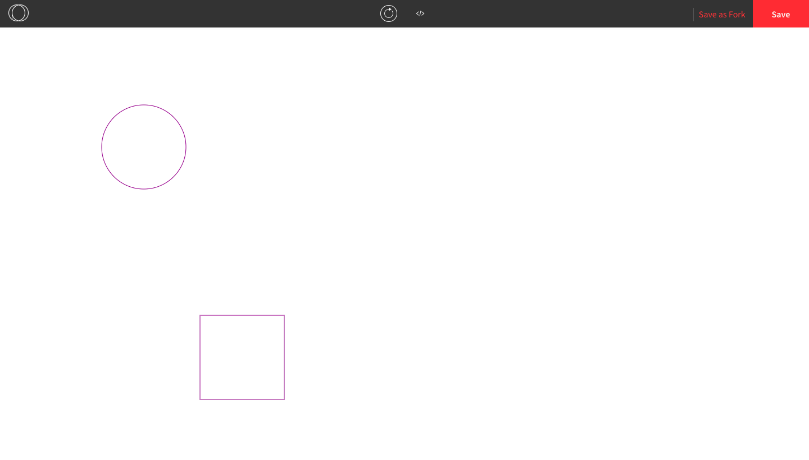
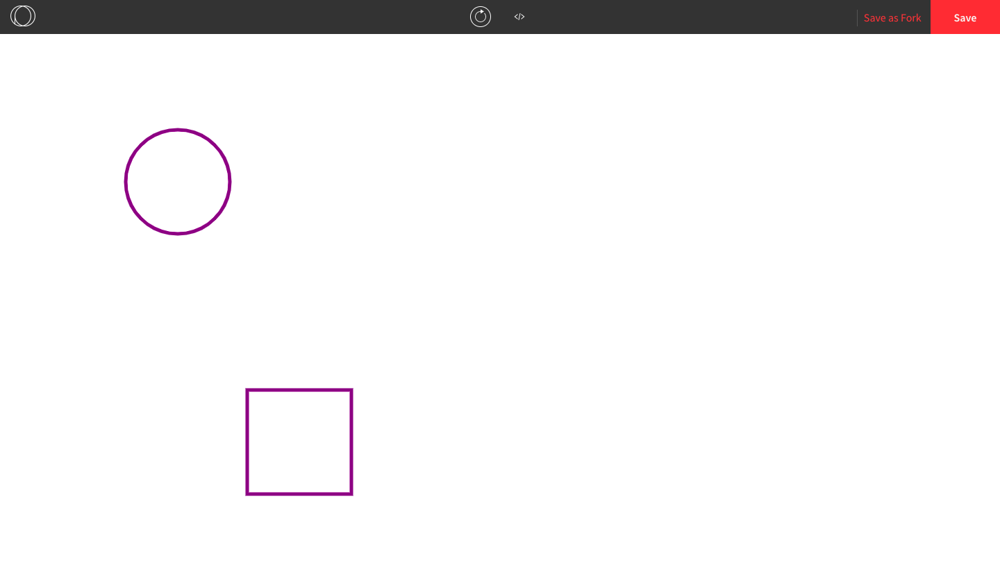
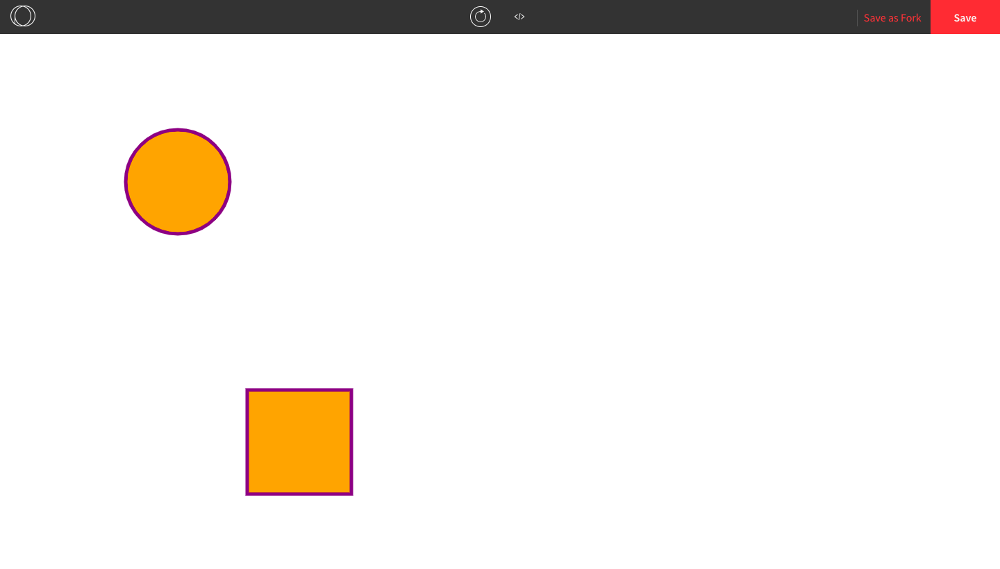
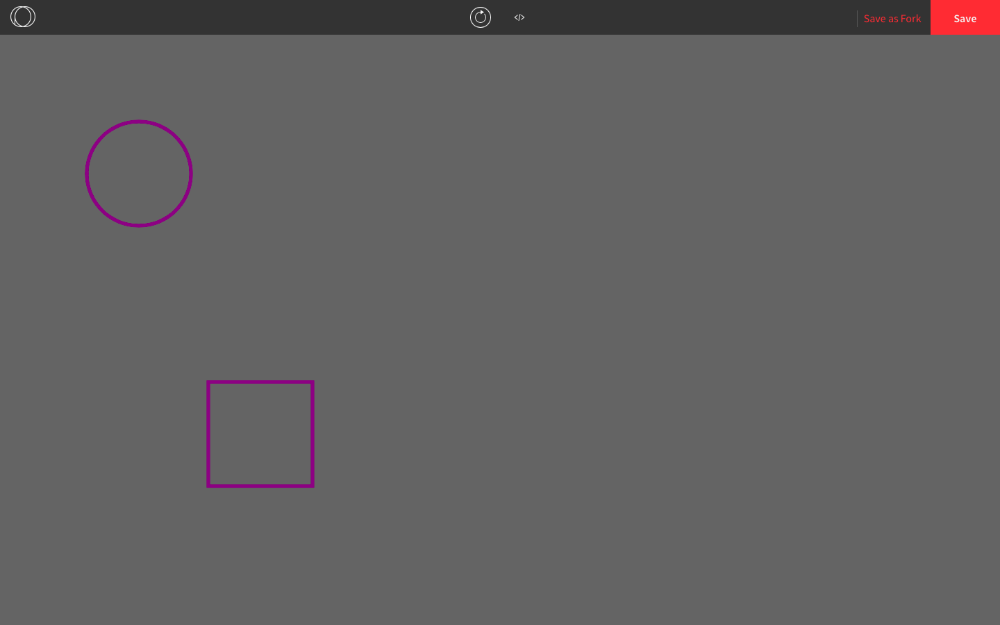
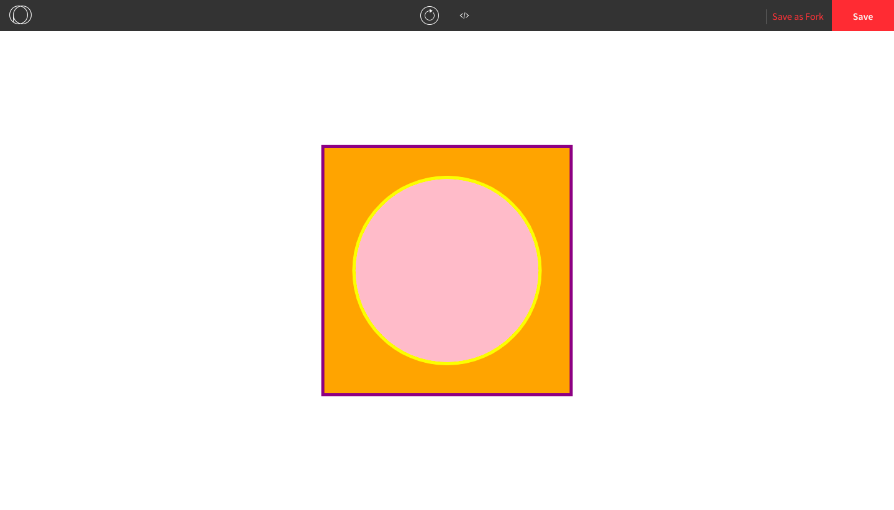

## Colours in Processing

### RGB Values

All colours that can be displayed on a computer can be expressed using a combination of 24 zeros and ones (i.e. binary digits, or bits). The most common ways to express them are using a red-green-blue (**RGB**) value. An RGB value shows how to create the colour using combinations of red, green, and blue. It is often represented as a tuple in which each number is an 8-bit integer ranging from 0 to 255.

Here are the RGB values of common colours.

| Colour | RGB value       |
| ------ | --------------- |
| Black  | (0, 0, 0)       |
| White  | (255, 255, 255) |
| Red    | (255, 0, 0)     |
| Orange | (255, 165, 0)   |
| Yellow | (255, 255, 0)   |
| Green  | (0, 255, 0)     |
| Blue   | (0, 0, 255)     |
| Purple | (128, 0, 128)   |
| Pink   | (255, 192, 203) |

### Colouring Shapes

We can add colour to shapes by colouring their outline or their interior. 

To colour their outline, we use the `stroke()` function. This tells the program that the outline of *all the shapes* from now on will be a certain colour.

```js
function setup() {
  createCanvas(windowWidth, windowHeight);
  stroke(128, 0, 128); // makes the outlines purple
  rect(300, 500, 150, 150);
  ellipse(200, 200, 150, 150);
}
```

Here is the result:



If we want the outline to be thicker, we can use the `strokeWeight()` function. 

```js
function setup() {
  createCanvas(windowWidth, windowHeight);
  stroke(128, 0, 128); // makes the outlines purple
  strokeWeight(5); // makes the outlines 5 pixels wide
  rect(300, 500, 150, 150);
  ellipse(200, 200, 150, 150);
}
```

Here is the result:



To colour the inside of a shape, we use the `fill()` function. This tells the program that the inside of all the shapes from now on will be a certain colour.

```js
function setup() {
  createCanvas(windowWidth, windowHeight);
  stroke(128, 0, 128); // makes the outlines purple
  strokeWeight(5); // makes the outlines 5 pixels wide
  fill(255, 165, 0); // makes the inside orange
  rect(300, 500, 150, 150);
  ellipse(200, 200, 150, 150);
}
```

Here is the result:



If we want the outline or interior to be transparent, we can use `noStroke()` or `noFill()`.

```js
function setup() {
  createCanvas(windowWidth, windowHeight);
  background(100); // makes the background grey
  stroke(128, 0, 128);
  strokeWeight(5);
  noFill(); // makes the interior transparent
  rect(300, 500, 150, 150);
  ellipse(200, 200, 150, 150);
}
```

Here is the result:



Just like we can display images based on the coordinates of the center of the image, we can also display shapes based on the center of the image. We can use `rectMode(CENTER)` to do this. There is also a function called `ellipseMode()` that can take arguments such as `RADIUS` or `CORNERS` to change the default behaviour.

We can also use different colours for outlines and interiors of different shapes. All we have to do is call `stroke()` or `fill()` again with a new colour, which **overrides** the instructions from previous function call.

```js
function setup() {
  createCanvas(windowWidth, windowHeight);
  stroke(128, 0, 128);
  fill(255, 165, 0);
  strokeWeight(5);
  
  rectMode(CENTER); // all new rectangles will be placed based on their center coordinate
  rect(windowWidth/2, windowHeight/2, 400, 400);
  
  stroke(255, 255, 0); // overrides the previous stroke() function
  fill(255, 192, 203); // overrides the previous fill() function
  
  ellipse(windowWidth/2, windowHeight/2, 300, 300);
}
```

Here is the result:


