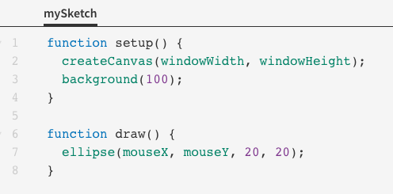

## Variables and Functions in Processing

When you go to [openprocessing.org](openprocessing.org), this is the code for the default sketch:



Let's figure out what these variables and functions are.

### Variables

Variables are values that can vary. In math they are usually represented with symbols such as `x` whereas in computer science they are usually represented with descriptive words.

There are four variables in the code for the default sketch: `windowHeight`, `windowWidth`, `mouseX`, and `mouseY`.

`windowHeight` and `windowWidth` are the dimensions of the canvas window. These dimensions will depend on the size of your computer screen.

`mouseX` and `mouseY` are the coordinates of current location of your mouse cursor on the canvas. We'll learn more about coordinates later on.

Whenever we want to see the value of a variable, we can **print** it to the **console**, which is the black window located at the bottom of the screen.


### Functions

A function takes an input and performs a sequence of steps to give an output. They have a name and are followed by a pair of parentheses. When a function is **called**, the inputs are placed inside the parentheses. The names of the inputs are called **parameters** and the values of the parameters are called **arguments**.

There are five functions in the code for the default sketch: `setup()`, `createCanvas()`, `background()`, `draw()`, and `ellipse()`.

`setup()` and `draw()` are customozable functions. Depending on what we want our sketch to look like, we would put different commands inside the curly braces.

`createCanvas()`, `background()`, and `ellipse()` are not customizable. `createCanvas()` creates the canvas for our sketch to go on and the parameters are the dimensions. `background()` changes the background colour of the canvas and its parameters represent the colour. `ellipse()` draws and ellipse (a round shape resembling a stretched circle) and its parameters are the coordinates and size.


### Line Comments

We can annotate our code by using line comments. Line comments begin with two forward slashes `//` and can be places after a line or code or on a blank line.
They can provide explanations and reminders for us so that our code is easier to read and understand.

```js
function setup() {
	createCanvas(windowWidth, windowHeight); //  Creates the canvas to be the maximum size 
	background(100); // Makes the background light grey
}

function draw() {
	ellipse(mouseX, mouseY, 20, 20); // Draws little white circles wherever the mouse moves to
}

```
