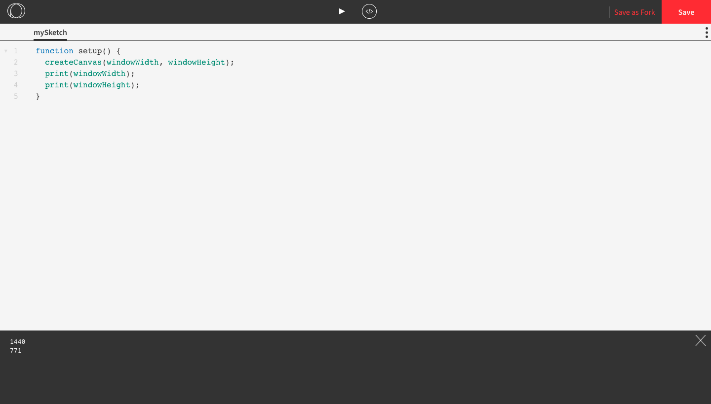

## Variables and Functions in Processing

When you go to [https://openprocessing.org/sketch/create](https://openprocessing.org/sketch/create), this is the code for the default sketch:


Let's figure out what these variables and functions are.

### Variables

Variables are values that can vary. In math they are usually represented with symbols such as `x` whereas in computer science they are usually represented with descriptive words.

There are four variables in the code for the default sketch: `windowWidth`, `windowHeight`, `mouseX`, and `mouseY`.

`windowHeight` and `windowWidth` are the dimensions of the canvas window. These dimensions will vary depending on the size of your computer screen and whether you have your browser in full screen mode.

`mouseX` and `mouseY` are the coordinates of current location of your mouse cursor on the canvas. We'll learn more about coordinates later on.

### Functions

A function takes an input and performs a sequence of steps to give an output. In math they are usually represented with symbols such as `f` whereas in computer science they are usually represented with descriptive words. In both math and computer science, functions use parentheses to store their inputs.

Functions have a name and are followed by a pair of parentheses. When a function is **called**, the inputs are placed inside the parentheses. The names of the inputs are called **parameters** and the values of the parameters are called **arguments**.

There are five functions in the code for the default sketch: `setup()`, `createCanvas()`, `background()`, `draw()`, and `ellipse()`.

`setup()` and `draw()` are customozable functions. We customzie them so that our sketch to looks and does exactly what we want. The difference between them is that `setup()` is automatically called once at the beginning whereas `draw()` is automatically called 60 times per second.

For these functions, we use the **keyword** `function` followed by the name of the function with the parentheses, and place the commands inside the curly braces. The opening curly brace `{` is on the same line as the function name and the closing curly brace `}` is on a line on is own. The section inside the curly braces is called the **body** and the commands in the body begin with one tab space. Indenting is a convention in most programming language that makes code easier to read.

`createCanvas()`, `background()`, and `ellipse()` are not customizable. 
* `createCanvas()` creates the canvas for our sketch to go on and the parameters are the dimensions. 
* `background()` changes the background colour of the canvas and its parameters represent the colour. We'll learn about colours later on.
* `ellipse()` draws and ellipse (a round shape resembling a stretched circle) and its parameters are the coordinates and size.


### Line Comments

We can annotate our code by using line comments. Line comments begin with two forward slashes `//` and can be places after a line or code or on a blank line.
They can provide explanations and reminders for us so that our code is easier to read and understand.

```js
function setup() {
  createCanvas(windowWidth, windowHeight); //  Creates the canvas to be the maximum size 
  background(100); // Makes the background grey
}

function draw() {
  ellipse(mouseX, mouseY, 20, 20); // Draws little circles wherever the mouse moves
}

```

### print()

The `print()` function is useful for looking at what specific values are being stored in a variable. For example, if we want to know the exact size of the canvas, we can use `print(windowHeight);` and `print(windowWidth);`. We would put these commands inside the body of the `setup()` function so that it runs only once. These values get printed to the **console**, which is a window that pops up at the bottom of your screen.



In this case, we can see that the dimensions of the canvas are 1440 pixels by 771 pixels.
