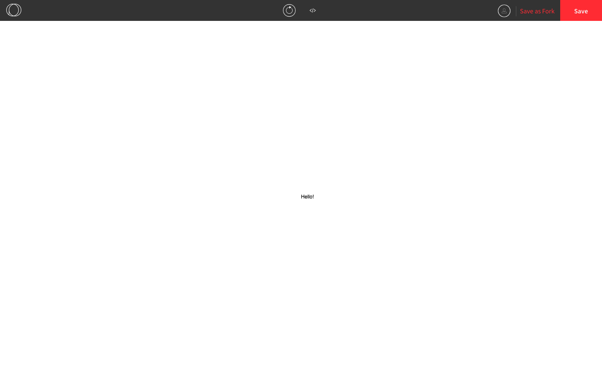
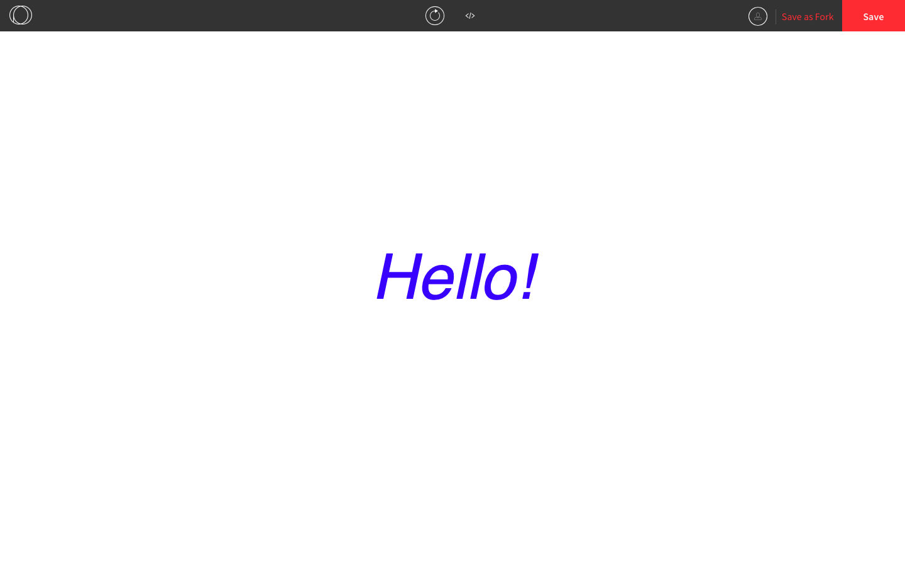
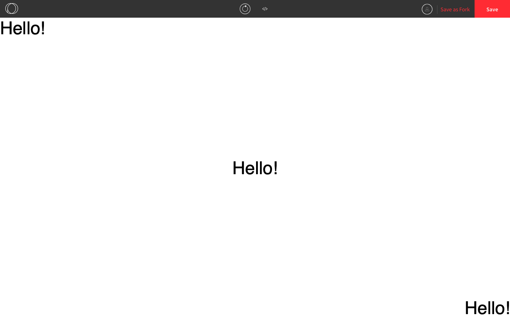
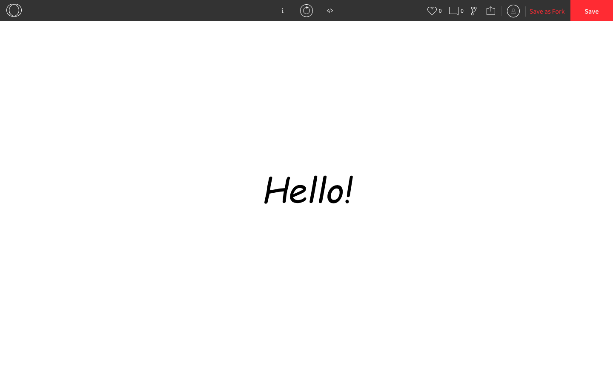

## Strings and Text in Processing

In an earlier example, we used a **string**.

```js
function preload() {
  doge = loadImage("doge.png"); // "doge.png" is a string
}
```

Strings are used to represent text and are enclosed in double quotation marks `"` or single quotation marks `'`. 

We can use strings to print text to the console.

```js
function setup() {
  createCanvas(windowWidth, windowHeight);
}

function draw() {
  print("Testing...");
}
```

We can **concatenate** strings by using the `+` operator.

```js
function setup() {
  createCanvas(windowWidth, windowHeight);
}

function draw() {
  print("The x-coordinate of the cursor is " + mouseX);
}
```

We can also use strings to print text onto the canvas using the `text()` function. The `text()` function takes three parameters: the string, the x-coordinate, and the y-coordinate.

```js
function setup() {
  createCanvas(windowWidth, windowHeight);
  text("Hello!", windowWidth/2, windowHeight/2)
}
```



Here are some other things we can do with text:

* Change the colour using `fill()`
* Make the font smaller or bigger using `textSize()` 
* Change the font style using `textStyle()` and the following constants:
  * `NORMAL`, `ITALIC`, `BOLD`, `BOLDITALIC`

```js
function setup() {
  createCanvas(windowWidth, windowHeight);
  fill(0, 0, 255); // makes the text blue
  textSize(100); // makes the font size 100
  textStyle(ITALIC); // makes the text italicized
  textAlign(CENTER); 
  text("Hello!", windowWidth/2, windowHeight/2)
}
```


* Align the text using `textAlign()` and the following constants:
  * `CENTER`, `TOP`, `BOTTOM`, `LEFT`, `RIGHT`

```js
function setup() {
  createCanvas(windowWidth, windowHeight);
  textSize(50);
  textAlign(LEFT, TOP);
  text("Hello!", 0, 0); // top-left
  textAlign(CENTER, CENTER);
  text("Hello!", windowWidth/2, windowHeight/2); // center
  textAlign(RIGHT, BOTTOM);
  text("Hello!", windowWidth, windowHeight); // bottom-right
}
```



We can also use any font we want by uploading the `.ttf` (TrueType Font) or `.otf` (OpenType Font) file for it. We can search online to find the file for the font we want and load it similar to how we load an image. To load a font file we use `loadFont()` and to use the font we use `textFont()`.

```js
function preload() {
  comicSans = loadFont("comicSans.ttf"); // "comicSans.ttf" is a file that was found online and uploaded
}

function setup() {
  createCanvas(windowWidth, windowHeight);
  textFont(comicSans, 100); // we can put the font size here instead of using textSize()
  textAlign(CENTER);
  text("Hello!", windowWidth/2, windowHeight/2);
}
```



