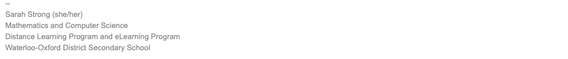

## Email Etiquette
### Why Use Email Instead of Instant Messaging?

Emails are more professional than instant messages and are the de facto way of communicating in writing to companies and other organizations. Carelessly written emails may cause the recipient to be offended or have a bad impression of you, so it's important to be aware of emailing etiquette. There are also several features of emails that do not exist in instant messages that you should be aware of when writing an email.

### Subject Line

Unlike instant messages, all emails include a subject line. The subject should be descriptive and be capitalized in title case.

### Salutation

The salutation (opening line) of an email consists of three parts.

1. **Greeting**. Choose a formal or casual greeting to shows an appropriate amount of respect for the recipient. Here are some examples of greetings.

   - Dear
   - Good morning
   - Good afternoon
   - Hello
   - Hi
   - Hey

2. **Recipient's name**. When writing the recipient's name, be sure to write it exactly as they write it. For example, don't shorten "Thomas" to "Tom" if they have addressed themself as "Thomas".

   If you are formally addressing an adult, avoid using only their first name. Either write their name in full, with or without an honourific (i.e. a title such as *Mr.* or *Ms.*), or just use an honourific followed by their last name.

   If recipient is a woman and are unsure whether they are married, use *Ms* or *Ms.* instead guessing whether they prefer *Miss*, *Mrs.*, or different title. If the recipient uses a less common title such as *Dr.*, be sure to use that if that is how they address themself.  

3. **Final punctuation**. There are three commonly used punctuation marks that terminate the salutation. Colons are more formal than commas and en dashes, and typically used only when the greeting is *Dear.* Note that an en dash is not the same as a hyphen (-), as it is slightly longer. **

   - Comma (,)
   - Colon (:)
   - En Dash (–)

### Body 

This is the main portion of the email. **Avoid** the following:

- Writing a message when you're angry
- Sending a message that you would not say to a person's face
- Forwarding messages without the original sender's permission
- Revealing private information
- Editing quoted messages to change the overall meaning
- Writing in all capital letters
- Sarcasm
- Slang words and expressions
- Overusing exclamation points
- Emojis and emoticons
- Acronyms used for texting (e.g. LOL, FTW, IDK)

Be sure to describe your message carefully and write using formal English. Use polite words and expressions such as "please" and "thank you". 

Keep in mind that when you receive an email, the sender doesn't necessarily expect you to respond immediately. If you are asked a question you are unsure of, consider taking some time to figure it out before responding. 

### Sign-Off

The sign-off (a.k.a. valediction) of an email should match the tone of the email. Here are some examples of sign-offs.

- Thanks
- Thank you
- Have a nice day
- Talk soon
- Sincerely
- Best
- Regards
- Cheers

The sign-off should be followed by a comma, a line break, then your name.

### Signature

A signature is an optional feature that appears at the very bottom of an email. Signatures are often used to provide more information about the person who sent it, such as their occupation, personal pronouns, and contact information. Signatures sometimes include "inspirational" quotes.

If you would like to create an email signature, click on your name at the top-right corner of the page, select *Account Settings* in the dropdown menu, then select the *Email* tab. There, you will find a place to create your email signature.

### Attachments

You can attach files to emails for the recipient to view. If you do this, you should mention this in the email body so that the recipient notices it and knows what it is. You may use expressions such as "See attached for ..." or "I've attached a ..." to inform them of the attachment(s).

### To, CC, and BCC

When you are sending a copy of an email to someone you have three options for where to enter their email address. 

1. Option 1: *To*. If you are addressing the person directly, you should put their email address under *To*.

2. Option 2: *CC* (**C**arbon **C**opy). If you are not addressing the person directly, you should use *CC*. This lets the *CC* recipient know that you are addressing someone else in the email (which is found under *To*) and are sending the message for their reference. When you do this, you may wish to include a notice such as "I've CC'd ..." to inform the main recipient that the email has also been sent to other people.

3. Option 3: *BCC* (**B**lind **C**arbon **C**opy). If you are sending the email to more than one person and would not like to reveal their email addresses to each other, you should put them all under *BCC*.

### Reply Vs. Reply-All Vs. Forward

There are several ways to respond to an email.

1. Option 1: *Reply*. Use this when you are sending the response only to the original sender. 

2. Option 2: *Reply-All*. Use this when you are sending the response to the original sender and everyone else (except those under *BCC*) who received the original message.

3. Option 3: *Forward*. Use this when you are sending a copy of a message for someone else to read. **Never forward a message without the original sender's permission**. Be aware that when you forward a message, you are also forwarding all the attachments.

### Exemplar

Here is an example of an email that follows the emailing etiquette outlined above.

