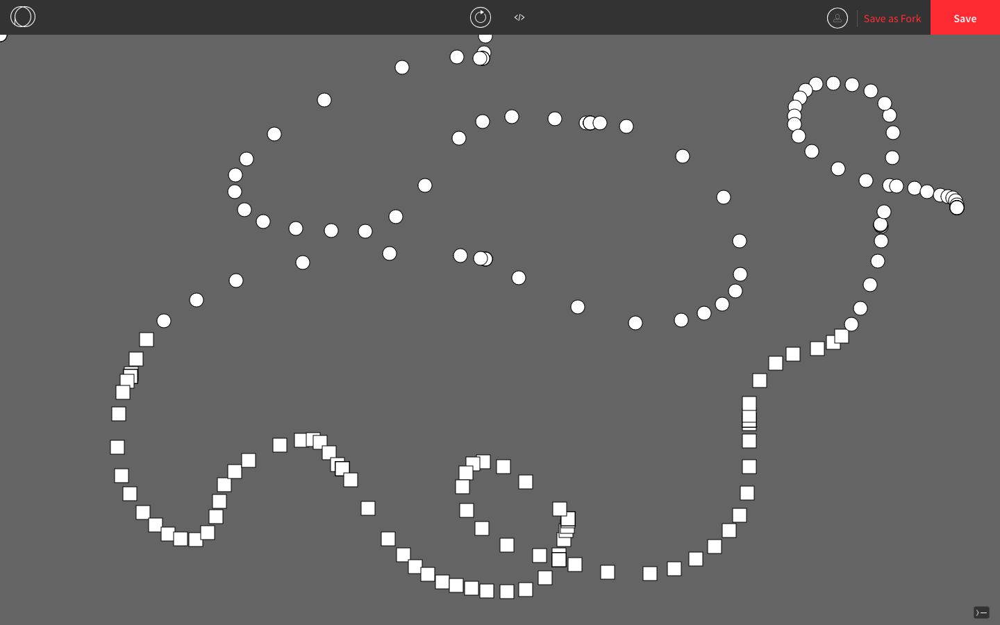
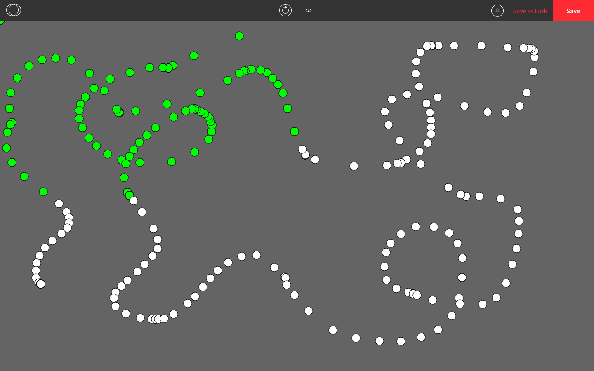
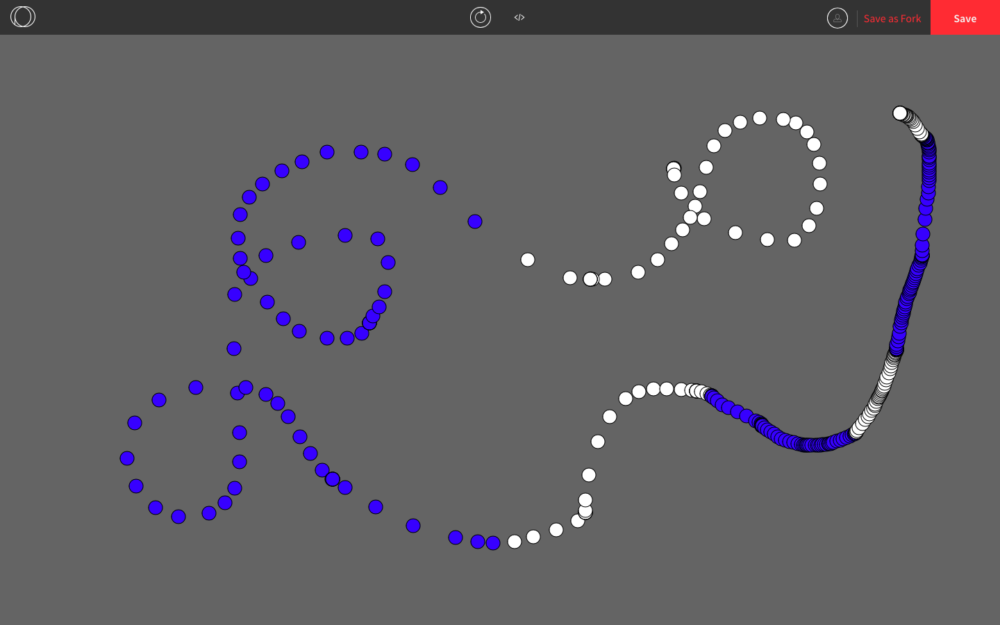
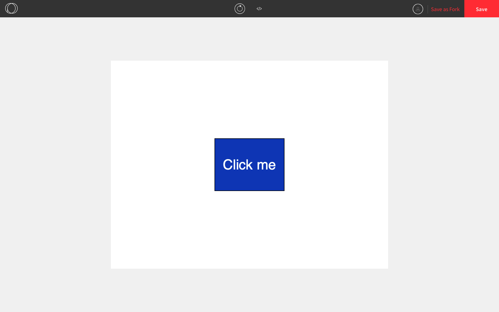

## Operators in Processing

**Operators** are symbols that perform an operation. The operators we've seen so far are:

* Addition operator: `+`
* Subtraction operator: `-`
* Multiplication operator: `*`
* Division operator: `/`
* Assignment operator: `=`
* Negation operator: `!`

### Boolean Expressions

Previously, we saw Boolean variables (i.e. variables whose values are `true` or `false`).

```js
function setup() {
  createCanvas(windowWidth, windowHeight);
}
  
function draw() {
  background(100);
  if (mouseIsPressed) { // mouseIsPressed is a Boolean variable
    ellipse(mouseX, mouseY, 50, 50); 
  } if (keyIsPressed) { // keyIsPressed is a Boolean variable
    ellipse(mouseX, mouseY, 25, 25); 
  }
}
```

We can also create **Boolean expressions** using various types of operators.

**Comparison operators** compare the magnitudes of two numbers to produce a `true` or `false` statement.

| Operator Name            | Operator Symbol | Example  | Explanation                                                  |
| ------------------------ | --------------- | -------- | ------------------------------------------------------------ |
| Less Than                | `<`             | `3 < 5`  | 3 is less than 5, so the expression is `true`.               |
| Greater Than             | `>`             | `3 > 5 ` | 3 is not greater than 5, so the expression is `false`.       |
| Less Than or Equal To    | `<=`            | `3 <= 5` | 3 is less than or equal to 5, so the expression is `True`.<br /> `<=` is supposed to look like the ≤ symbol. |
| Greater Than or Equal To | `>=`            | `3 >= 5` | 3 is neither greater than nor equal to 5, so the expression is false.<br />`>=` is supposed to look like the ≥ symbol. |

**Equality operators** check whether two numbers are equal or not equal to produce a `true` or `false` statement.

| Operator Name | Operator Symbol | Example   | Explanation                                                  |
| ------------- | --------------- | --------- | ------------------------------------------------------------ |
| Equals        | `==`            | `3 == 5 ` | 3 is not equal to 5, so the expression is `false`.<br/></br>Mixing up `=` and `==` is a notorious error in computer science. This applies to many programming languages, not just Python. |
| Equals        | `===`           | `3 === 5` | 3 is not equal to 5, so the expression is `false`.<br/></br> The difference between them is that `===` checks to ensure that both sides belong to the same data type. Sometimes `==` can give false positives when they are different data types. |
| Not Equals    | `!=`            | `3 != 5`  | 3 is not equal to 5, so the expression is `true`.<br />`!=` is supposed to look like the ≠ symbol. |
| Not Equals    | `!==`           | `3 !== 5` | 3 is not equal to 5, so the expression is `true`.<br />`!=` is supposed to look like the ≠ symbol. |

**Boolean operators** check whether two numbers are equal or not equal to produce a `true` or `false` statement. By convention, their names are written in capital letters.

| Operator Name | Operator Symbol | Example              | Explanation                                                  |
| ------------- | --------------- | -------------------- | ------------------------------------------------------------ |
| NOT           | `!`             | `!(3 < 5) `          | The statement in the parentheses is `true`, so the expression is the negation of that, which is `false`. |
| AND           | `&&`            | `(3 < 5) && (3 > 5)` | At least one of those two statements is `false`, so the expression is `false`.<br/></br>There is a similar operator, `&`, called a bitwise operator, which does something completely different. Look it up if you're interested. |
| OR            | `\|\|`          | `3 < 5) \|\|(3 > 5)` | At least one of those two statements is `true`, so the expression is `true`.<br></br>There is a similar operator, `\|`, called a bitwise operator, which does something completely different. Look it up if you're interested.<br></br>The pipe character is typically found above or beside the ENTER key on your keyboard. |

We can use these operators to check more complex conditions, such as whether the cursor is currently in a specific section of the canvas.

Here is an example that draws different shapes depending on which half (top or bottom) the canvas the cursor is.

```js
function setup() {
  createCanvas(windowWidth, windowHeight);
  background(100);
  rectMode(CENTER);
}

function draw() {
  if (mouseY <= windowHeight/2) { // if the cursor is in the top half
    ellipse(mouseX, mouseY, 20, 20); 
  } else { // if the cursor is in the bottom half
    rect(mouseX, mouseY, 20, 20); 
  }
}
```



This program draws circles in different colours depending on which quadrant the cursor is in.

```js
function setup() {
  createCanvas(windowWidth, windowHeight);
  background(100);
}

function draw() {
  if (mouseX <= windowWidth/2 && mouseY <= windowHeight/2) { // if the cursor is in the top-left quadrant
    fill(0, 255, 0);
  } else {
    fill(255);
  }
  
  ellipse(mouseX, mouseY, 20, 20); 
}
```



This program draws circles in different colours depending on which half (left or right) the cursor is in and whether the mouse is being held down.

```js
function setup() {
  createCanvas(windowWidth, windowHeight);
  background(100);
  rectMode(CENTER);
}

function draw() {
  if (mouseX <= windowWidth/2 || mouseIsPressed) {
    fill(0, 0, 255);
  } else {
    fill(255);
  }
  
  ellipse(mouseX, mouseY, 20, 20); 
}
```



If we want to check whether our cursor is hovering over a rectangle on the screen, we can check whether `mouseX` and `mouseY` are in specific ranges.

```js
function setup() {
  createCanvas(800, 600);
  background(255);
  rectMode(CENTER); // draws the blue rectangle
  fill(6, 69, 173);
  rect(400, 300, 200, 150);
  textAlign(CENTER, CENTER); // writes "Click me" in white
  textSize(40);
  fill(255);
  text("Click me", 400, 300);
}

function draw() {
  if (300 < mouseX && mouseX < 500 && 225 < mouseY && mouseY < 375) { // checks if the cursor is in the rectangle
    if (mouseIsPressed) {		
      print("Hello!"); // prints "Hello" to the console when the button is pressed down
    }
  }
}
```



### Order of Operations

With the numerical operators `+`, `-`, `*`, and `/` the order of operations follows BEDMAS.

```js
function setup() {
  print(3 + 5 * 4); // prints 23
  print((3 + 5) * 4); // prints 32
}
```

The boolean operators follow this order: `||`, `&&`, and `!`. To ensure that the order of operations is what you intend, you can use parentheses in boolean expressions.

### Increment Operators

Increment operators are used to change the value of a custom variable by adding, subtracting, multiplying, or divinding from its previous value.

| Operator | Example       | New Value of `score`                                         |
| -------- | ------------- | ------------------------------------------------------------ |
| `+=`     | `score += 7;` | Adds 7 to the value of `score`.<br><br/>Essentially equivalent to `score = score + 7;`. |
| `-=`     | `score -= 2;` | Subtracts 2 from the value of `score`.<br><br/>Essentially equivalent to `score = score - 2;`. |
| `*=`     | `score *= 2;` | Multiplies the value of `score` by 2<br><br/> Essentially equivalent to `score = score * 2;`. |
| `/=`     | `score /= 2;` | Divides the value of `score` by 2 then takes the dividend.<br><br/>Essentially equivalent to `score = score / 2`;. |
| `++`     | `score++;`    | Adds 1 to the value of `score`.<br><br/>Essentially equivalent to `score = score + 1;` and `score += 1;`. |
| `--`     | `score--;`    | Subtracts 1 from the value of `score`.<br><br/>Essentially equivalent to `score = score - 1;` and `score -= 1;`. |

This is an example from before.

```js
let coordinate = 0;

function setup() {
  createCanvas(windowWidth, windowHeight);
  background(100);
}

function draw() {
  ellipse(coordinate, coordinate, 20, 20); 
  coordinate = coordinate + 10; // the value of the coordinate increases by 10 
}
```

We can change `coordinate = coordinate + 10` to `coordinate += 10` and the program would do the exact same thing. 

```js
let coordinate = 0;

function setup() {
  createCanvas(windowWidth, windowHeight);
  background(100);
}
  
function draw() {
  ellipse(coordinate, coordinate, 20, 20); 
  coordinate += 10; // the value of the coordinate increases by 10 
}
```


