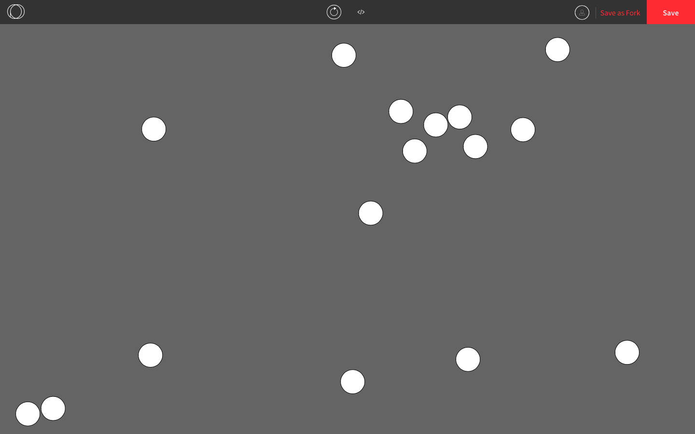
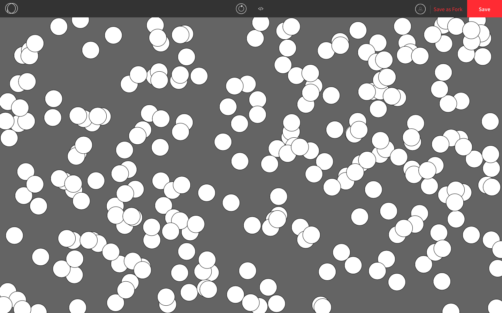
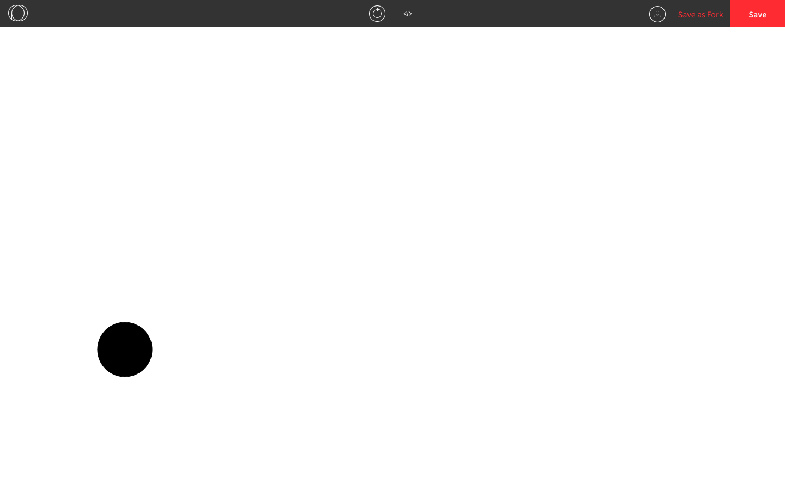

## Key and Mouse Events in Processing

So far we've seen the built-in variables `mouseIsPressed` and `keyIsPressed` used to detect mouse and key activity. These detect whether the mouse or a key is currently being held down. If we want to detect a single mouse click or key press, we need the functions `mousePressed()` and `keyPressed()`. These functions are called  **event listeners** or **event handlers**.

The way we use these two functions is similar to `setup()`, `preload()`, `draw()`.  We are overriding them, so we need the keyword `function` and we write them 

The following program draws circles at the cursor when the mouse is pressed.

```js
function setup() {
  createCanvas(windowWidth, windowHeight);
  background(100);
}

function mousePressed() {
  ellipse(mouseX, mouseY, 50, 50);
}
```

The following program draws circles in random places when any key on the keyboard is pressed.

```js
function setup() {
  createCanvas(windowWidth, windowHeight);
  background(100);
}

function keyPressed() {
  ellipse(random(windowWidth), random(windowHeight), 50, 50);
}
```



If we want to detect a particular key being pressed, we can do that by looking up the key's keycode. Every key that can be found on a keyboard  is assigned a number and we can use [http://keycode.info](http://keycode.info/) to look up the keycodes. These numbers are based on the key's value in the [ASCII table](https://www.cs.cmu.edu/~pattis/15-1XX/common/handouts/ascii.html) (ASCII is pronounced "askey"). 

There are several key that have their own constants built into Processing, including:

* `BACKSPACE` (`keyCode`: 8)
* `ENTER` (`keyCode`: 13)
* `ESCAPE` (`keyCode`: 27)
* `LEFT_ARROW` (`keycode`: 37)
* `UP_ARROW` (`keyCode`: 38)
* `RIGHT_ARROW` (`keyCode`: 39)
* `DOWN_ARROW` (`keyCode`: 40)

The full list of built-in constants can be found here on the [keyCode reference page](https://p5js.org/reference/#/p5/keyCode).

We can modify our previous example so that the circle is drawn only if the enter key is pressed.

```js
function setup() {
  createCanvas(windowWidth, windowHeight);
  background(100);
}

function keyPressed() {
  if (keyCode == ENTER) { // checks whether the key that was pressed was the enter key
    ellipse(random(windowWidth), random(windowHeight), 50, 50);
  }
}
```

We can also use keycodes when we use `keyPressed`. This function does the same thing as the above except it keeps drawing circles while the enter key is beind held down.

```js
function setup() {
  createCanvas(windowWidth, windowHeight);
  background(100);
}

function draw() {
  if (keyIsPressed) {
    if (keyCode == ENTER) { // checks whether the key that is being pressed is the enter key
      ellipse(random(windowWidth), random(windowHeight), 50, 50);
    }
  }
}
```



Suppose we want the same program except we use the spacebar instead. According to [http://keycode.info](http://keycode.info/), the keycode for spacebar is 32. Since there is no built-in constant for the spacebar keycode, we can just use 32.

```js
function setup() {
  createCanvas(windowWidth, windowHeight);
  background(100);
}

function draw() {
  if (keyIsPressed) {
    if (keyCode == 32) { // checks whether the key that is being pressed is the spacebar
      ellipse(random(windowWidth), random(windowHeight), 50, 50);
    }
  }
}
```

However, a better solution is to create a constant for the spacebar keycode since it will make our code easier to understand and easier to modify.

```js
const SPACE_KEY = 32; // retrieved from http://keycode.info

function setup() {
  createCanvas(windowWidth, windowHeight);
  background(100);
}

function draw() {
  if (keyIsPressed) {
    if (keyCode == SPACE_KEY) { // checks whether the key that is being pressed is the spacebar
      ellipse(random(windowWidth), random(windowHeight), 50, 50);
    }
  }
}
```

We can use a variety of keycodes to control the graphics on the canvas. Here is an example of moving a circle on the screen using various controls.

```js
const W_KEY = 87; // all retrieved from http://keycode.info
const A_KEY = 65;
const S_KEY = 83;
const D_KEY = 68; 
const SPACE_KEY = 32;

function setup() {
  createCanvas(windowWidth, windowHeight);
  xPos = windowWidth/2; // the circle is initially in the middle of the canvas
  yPos = windowHeight/2;
  fill(0); // makes the circle black
}

function draw() {
  background(255); // makes the background white
  ellipse(xPos, yPos, 100);
  if (keyIsPressed) {
    if (keyCode == UP_ARROW || keyCode == W_KEY) { // pressing the up arrow or the W key makes the circle move upwards
      yPos -= 5;
    } else if (keyCode == DOWN_ARROW || keyCode == S_KEY) { // pressing the down arrow or the S key makes the circle move downwards
      yPos += 5;
    } else if (keyCode == LEFT_ARROW || keyCode == A_KEY) { // pressing the left arrow or the A key makes the circle move to the left
      xPos -= 5;
    } else if (keyCode == RIGHT_ARROW || keyCode == D_KEY) { // pressing the right arrow or the D key makes the circle move to the left
      xPos += 5;
    }
  }
}

function mousePressed() { // pressing the mouse moves the circle to where the cursor is
  xPos = mouseX;
  yPos = mouseY;
}

function keyPressed() {
  if (keyCode == SPACE_KEY) { // pressing the spacebar moves the circle to the center of the screen
    xPos = windowWidth/2;
    yPos = windowHeight/2;
  }
}
```



We can also use the functions `mouseReleased()` and `keyReleased()`. They work just like `mousePressed()` and `keyPressed()` except they activate when the mouse or key is released (i.e. when you let go of it after pressing it down).

```js
function setup() {
  createCanvas(windowWidth, windowHeight);
  background(100);
}

function mouseReleased() {
  ellipse(mouseX, mouseY, 50, 50); // draws a circle when the mouse is released
}
```

```js
const SPACE_KEY = 32; // retrieved from http://keycode.info

function setup() {
  createCanvas(windowWidth, windowHeight);
  background(100);
}

function keyReleased() {
  if (keyCode == SPACE_KEY) {
    ellipse(mouseX, mouseY, 50, 50); // draws a circle when the spacebar is released
  }
}
```
