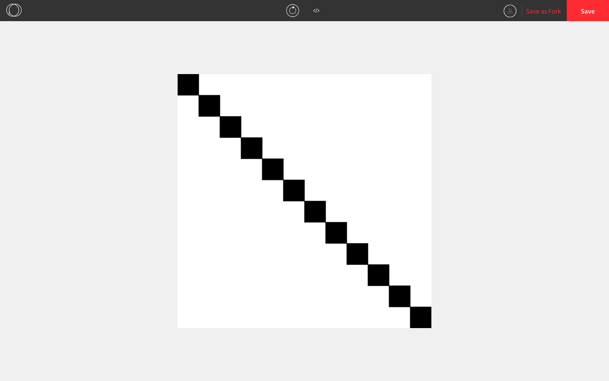

## Loops in Processing

### Draw()

We have the built-in function `draw()` that is called repeatedly until the program is terminated. For example, the program below keeps drawing squares one by one along a diagonal.

```js
let coordinate = 0;

function setup() {
  createCanvas(600, 600);
  background(255);
  fill(0);
}

function draw() {
  frameRate(5); // slows down the frame rate so that we can see the squares
  rect(coordinate, coordinate, 50, 50); // draws a square
  coordinate += 50; // updates the coordinates for the next square
}
```



If we wanted the squares to show up all at once, one option is to type out `rect()` twelve times, but that is tedious and unnecessary. What we can do instead is use a **loop structure** , which repeatedly executes a specified block of code. This process of repetition is called **iteration**. 

### While Loops

One of the loop strucures we can use is called a ***while* loop**. The structure is almost identical to an *if* statement. The difference between the two of them is that we use the keyword `while` instead of `if` and the body is repeatedly as long as the boolean expression is true.

```js
if (mouseY <= windowHeight/2) { 
  ellipse(mouseX, mouseY, 20, 20); // draw a circle if the cursor is in the top half
} 
```

```js
while (mouseY <= windowHeight/2) { 
  ellipse(mouseX, mouseY, 20, 20); // keep drawing a circle as long as the cursor is in the top half
}
```

Let's go back to the original example, with the diagonal squares. Suppose we want all the squares to appear all at once rather than one by one. If we do write out each square separately, it would look like this.

```js
function setup() {
  createCanvas(600, 600);
  background(255);
  fill(0);
  rect(0, 0, 50, 50); // Note: Don't actually do it this way!
  rect(50, 50, 50, 50);
  rect(100, 100, 50, 50);
  rect(150, 150, 50, 50);
  rect(200, 200, 50, 50);
  rect(250, 250, 50, 50);
  rect(300, 300, 50, 50);
  rect(350, 350, 50, 50);
  rect(400, 400, 50, 50);
  rect(450, 450, 50, 50);
  rect(500, 500, 50, 50);
  rect(550, 550, 50, 50);
  // right at this point, everything shows up on the canvas
}
```

Each line is almost identical with the exception of the coordinates. What we can do is store the coordinate as a variable and repeatedly call `rect(coordinate, coordinate, 50, 50)` and `coordinate += 50`.

```js
let coordinate = 0; // the coordinate of the first square is (0, 0)

function setup() {
  createCanvas(600, 600);
  background(255);
  fill(0);
  while (coordinate < 600) { // the next two lines will keep repeating as long as coordinate < 600
    rect(coordinate, coordinate, 50, 50); 
    coordinate += 50 
  }
  // right at this point, everything shows up on the canvas
}
```

Now the program will show the diagonal squares all at once. This is because the canvas is updated once all the lines in `setup()` have been executed.

When we are creating our own loops, one thing to be aware of is to avoid **infinite loops**. These loops run indefinitely and anything that is supposed to happen after it will not run. They happen when the boolean expression is never false. 

Here is an example of an infinite loop. This program will not show anything on the screen.

```js
let coordinate = 0; // the coordinate of the first square is (0, 0)

function setup() {
  createCanvas(600, 600);
  background(255);
  fill(0);
  while (0 <= coordinate) { // the next two lines will keep repeating as long as 0 <= coordinate (which is always!)
    rect(coordinate, coordinate, 50, 50); 
    coordinate += 50 
  }
  // right at this point, everything should show up on the canvas (but it doesn't!)
}
```

### For Loops

There is another loop structure called a ***for* loop**. The syntax looks different than a *while* loop, but it contains all the key parts:

* a variable getting initialized
* a boolean expression involving the variable that is repeatedly being checked
* the variable getting updated

Here is the example from before with the three key parts shown.

```js
let coordinate = 0; // the coordinate variable is getting initialized

function setup() {
  createCanvas(600, 600);
  background(255);
  fill(0);
  while (coordinate < 600) { // we're checking if the coordinate is still less than 600
    rect(coordinate, coordinate, 50, 50); 
    coordinate += 50 // the coordinate variable is getting updated
  }
}
```

A *for* loop takes these three parts and puts them all on one line, separated by semicolons. They use the keyword `for`.

Here is the example from above rewritten using a *for* loop instead.

```js
function setup() {
  createCanvas(600, 600);
  background(255);
  fill(0);
  for (let coordinate = 0; coordinate < 600; coordinate += 50) { // the three parts are all here
    rect(coordinate, coordinate, 50, 50); 
  }
}
```
