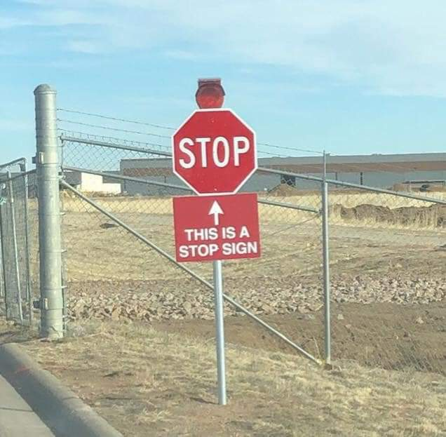
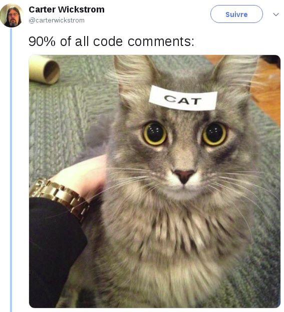

### Style Guide for P5.js

Just like we have rules for formal English, we have rules for **clean code**. When we write code according to the standards, it's easier to read and easier to find bugs. 

The full style guide for Javascript can be found here: https://developer.mozilla.org/en-US/docs/MDN/Guidelines/Code_guidelines/JavaScript. We can follow most of these rules for our P5.js programs.

We can fix most of the spacing in our code using the keyboard shortcut CTRL+B in [openprocessing.org](http://openprocessing.org/sketch/create), but there are other things that we need to fix manually.

Here is a summary of the ones you should be mindful of in this course.

### Commas

All commas should have no space before it and one space after it. (This is the same rule as commas in English).
&nbsp;

### ✓

```js
function setup() {
  createCanvas(windowWidth, windowHeight); // the spacing around the comma is good
  ellipse(mouseX, mouseY, 30, 30); // same here
}
```
&nbsp;

### ✘

```js
function setup() {
  createCanvas(windowWidth,windowHeight); // there should be a space after each comma
  ellipse(mouseX,mouseY,30,30); // same here
}
```
&nbsp;
 
### Operators

The spacing around arithmetic operators (`+`, `-`, `*`, `/`) can vary based on whatever is easiest to read.
&nbsp;

### ✓

```js
print(3 + 5);
```

```js
print(3 + 5*4);
```

```js
print(10/5 - 2);
```
 
The operator `!` should not be followed by a space.
&nbsp;

### ✓

```js
function draw() {
  if (!mouseIsPressed) { 
    ellipse(mouseX, mouseY, 50, 50); 
  } 
}
```
&nbsp;

### ✘

```js
function draw() {
  if (! mouseIsPressed) { // there shouldn't be a space after the "!"
    ellipse(mouseX, mouseY, 50, 50); 
  } 
}
```
 
All other operators should have one space around it.
&nbsp;

### ✓

```js
for (let x = 0; x < windowHeight; x += 100) { // the spacing around each operator is good
  ellipse(mouseX, mouseY, 30, 30);
}
```
&nbsp;

### ✘

```js
for (let x=0; x<windowHeight; x+=100) { // the operators need spaces around them
  ellipse(mouseX, mouseY, 30, 30);
}
```
&nbsp;

### Parentheses

An opening parenthesis `(` in a function should not have any spaces around it. 
&nbsp;

### ✓

```js
function setup() { // the spacing around "(" is good
  createCanvas(windowWidth, windowHeight);
}
```
&nbsp;

### ✘

```js
function setup () { // there should be no space before "("
  createCanvas(windowWidth, windowHeight);
}
```

```js
function setup( ) { // there should be no space after "("
  createCanvas(windowWidth, windowHeight);
}
```

For an opening parenthesis in a boolean expression that comes after a keyword (`if`, `while`, `for`), we have the choice to put a space before it or to leave it out. If you use CTRL+B, it will add the space.
&nbsp;

### ✓

```js
if (mouseX < windowHeight/2) { // the spacing around "(" is good
  ellipse(mouseX, mouseY, 30, 30);
}
```

```js
while(mouseX < windowHeight/2) { // the spacing around "(" is good
  ellipse(mouseX, mouseY, 30, 30);
}
```

```js
for (let x = 0; x < windowHeight; x += 100) { // the spacing around "(" is good
  ellipse(mouseX, mouseY, 30, 30);
}
```

&nbsp;
### Curly Braces

When creating a block of code, an **opening curly brace** `{` is placed at the end of a line with a space before it and the **closing curly brace** `}` is placed at the beginning of a new line.
&nbsp;

#### ✓

```js
function setup() {
  createCanvas(windowWidth, windowHeight);
}
```
&nbsp;

#### ✘

```js
function setup(){ // the space before the { is missing here
  createCanvas(windowWidth, windowHeight);
}
```

```js
function setup() 
{ // the { should not be on its own line
  createCanvas(windowWidth, windowHeight);
}
```

```js
function setup() {createCanvas(windowWidth, windowHeight);} // the braces should not be on the same line
```

```js
function setup() 
  {createCanvas(windowWidth, windowHeight);} // the braces should not be on the same line
```

When we have a conditional structure with more than one condition, each condition should be on the same line as the closing brace from the previous condition.
&nbsp;

### ✓

```js
function draw() {
  if (mouseIsPressed) { 
    ellipse(mouseX, mouseY, 50, 50); 
  } else if (keyIsPressed) { // the keywords are placed on the same line as the "{" from the previous block
    rect(mouseX, mouseY, 50, 50); 
  } else { // same here
    line(mouseX, mouseY, 50, 50);    
  }
}
```
&nbsp;

### ✘

```js
function draw() {
  if (mouseIsPressed) { 
    ellipse(mouseX, mouseY, 50, 50); 
  } 
  else if (keyIsPressed) { // this should be merged with the previous line
    rect(mouseX, mouseY, 50, 50); 
  } 
  else { // same here
    line(mouseX, mouseY, 50, 50);    
  }
}
```

&nbsp;

### Semicolons

All statements end in a semicolon (with one exception, covered next). There is no space before the semicolon.
&nbsp;

#### ✓

```js
function setup() {
  createCanvas(windowWidth, windowHeight); // this semicolon is good
}
```
&nbsp;
 
#### ✘

```js
function setup() {
  createCanvas(windowWidth, windowHeight) ; // this semicolon should not have a space before it
}
```

```js
function setup() {
  createCanvas(windowWidth, windowHeight) // this semicolon is missing here
}
```
 
Exception: In a `for` loop, the last statement (the incrementation) should not end in a semicolon.
&nbsp;

### ✓

```js
for (let x = 0; x < windowHeight; x += 100) { // the x += 100 doesn't need a semicolon
  ellipse(mouseX, mouseY, 30, 30);
}
```
&nbsp;
 
### ✘

```js
for (let x = 0; x < windowHeight; x += 100;) { // the last semicolon isn't needed
  ellipse(mouseX, mouseY, 30, 30);
}
```

If a line contains more than one semicolon (e.g. in a `for` loop), each semicolon should be followed by a space.
&nbsp;

### ✓

```js
for (let x = 0; x < windowHeight; x += 100) { // the spacing after each semicolon is good
  ellipse(mouseX, mouseY, 30, 30);
}
```
&nbsp;

### ✘

```js
for (let x = 0;x < windowHeight;x += 100) { // each semicolon needs a space after it
  ellipse(mouseX, mouseY, 30, 30);
}
```

&nbsp;

### Indenting

Each new block of code is indicated by curly braces and each line in it is indented two or four spaces inwards. When you have a block within a block, you add another two or four spaces.
&nbsp;

### ✓

```js
function setup() { /
  createCanvas(windowWidth, windowHeight); // indentation here is good
  background(255); // same here
  fill(0); // same here
}
```

```js
function draw() {
  if (keyIsPressed) { // the indentation here is good
    if (keyCode == 32) { // same here
    	ellipse(int(random(256)), int(random(256)), 50, 50);  // same here
    }
  }
}
```
&nbsp;
 
### ✘

```js
function setup() { /
 createCanvas(windowWidth, windowHeight); // spacing is off here
background(255); // indentation is needed here
        fill(0); // too much indentation here
}
```

```js
function draw() {
if (keyIsPressed) {  // indentation is needed
if (keyCode == 32) // more indentation is needed
ellipse(int(random(256)), int(random(256)), 50, 50);  // even more indentation is needed
}
}
}
``` 
&nbsp;

### Variables and Constants

Give short, descriptive names to variables and write them using camelCase. 
&nbsp;

### ✓

```js
let diameter = 0;
```

```js
let xValue = 50;
```

```js
let length = 20;
```
&nbsp;
 
### ✘

```js
let asdf = 15; // no idea what this is for
```

```js
let my_variable = 42; // vague and doesn't use camel case
```

```js
let the_height_of_the_blue_rectangle = 100; // too long
```
 
Give short, descriptive names to constants and write them in SCREAMING_SNAKE_CASE.
&nbsp;

### ✓

```js
const SIZE = 8;
```

```js
const HALF_WAY = 770;
```
&nbsp;

### ✘

```js
const myConstant = 8;  // vague and doesn't use screaming snake case
```
 
&nbsp;

### Line Comments

Line comments are used to serve as explanations for what your code does and why it works. In school, line comments are important also because they show that you are aware of how your program works.

In a work environment, the target audience would be your coworkers who would potentially review your code. In this course, the target audience for your comments will be your classmates and your teacher.

Good comments don't point out obvious things, like this:




&nbsp;

### ✘

```js
function setup() { // sets up the stuff
  createCanvas(windowWidth, windowHeight); // creates the canvas
  background(0); // background colour
}
```
 
Good comments help make your code clear when it's not obvious what is going on. They can help explain your thinking so that someone reading it can understand how it works.
&nbsp;

### ✓

```js
function setup() { 
  createCanvas(windowWidth, windowHeight);
  background(255, 215, 0); // background colour is golden yellow
}
```

```js
function keyPressed() { 
  if (keyCode == 88) { // check if the user pressed the X key
     ellipse(50, 50, 100, 100);
  }
}
```

