## Debugging P5.js Programs

### Bugs

A computer **bug** is a human-made problem within a program. Bugs result in errors or unexpected outcomes. The process of fixing **buggy code** is called **debugging**.

### Types of Errors

#### Syntax Errors

**Syntax** in programming languages is like grammar in a human language.

Syntax errors include:

* Misspelling keywords (e.g. `function`, `if`,  `else`, `for`, `while`, etc.)
* Missing or incorrectly placing commas, semicolons, and operators
* Mismatching brackets or braces

The program below has several syntax errors. The yellow squiggly lines are warnings and the red squiggly lines are errors. We can hover over the squiggly lines or the little red boxes to see the warning and error messages. 

```js
funcition setUp() {
  createcanvas(800 600); 
  background(255); 
```

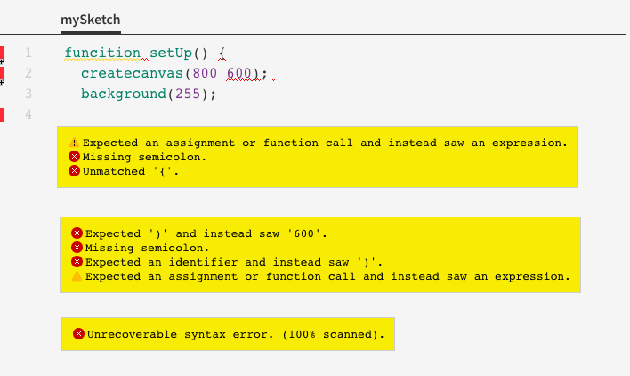

The code editor tells us that something is wrong with line 1, 2, and 4. 

On line 1, the editor doesn't recognize the expression`funcition` and thinks a semicolon is missing. It's supposed to say `function` but it was mispelled. Once we fix the spelling of `function` it will turn a different colour to indicate that the editor knows it is a keyword. The "missing semicolon" message will go away since the editor is no longer expecting a semicolon now that it recognizes the keyword.

Another error message on line 1 is "unmatched `{`". That's because we're missing a closing curly brace to match the open curly brace. We can add one on line 4 to indicate the end of the block of code. Once we do that, the error message on line 4 about the "unrecoverable syntax error" goes away since there is no longer an unfinished block of code.

On line 2, the first error message says "expected `)`". This is because the editor does not understand why we put two numbers next to each other and assumes that it's because we forgot a bracket. Here's what happens if we add the bracket between the numbers `800` and `600`.

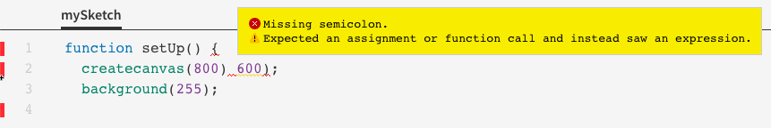

Now it's telling us that we're missing a semicolon after the bracket we jsut put in and it doesn't know why there's a closing bracket after `600`. That's because the original mistake wasn't a missing bracket – it was a missing comma. Error messages aren't always helpful and it's sometimes up to us to figure out what's actually causing the syntax errors. 

```js
function setUp() { // the spelling of "function" was corrected
  createcanvas(800, 600); // the comma was added
  background(255); 
} // the closing curly brace was added
```

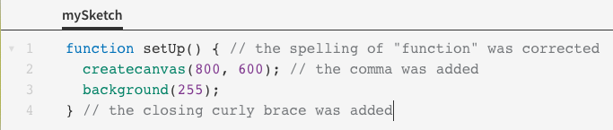


#### Runtime Errors

A **runtime error** happens after your program starts running. It causes an error message to be printed to the console, assuming your program doesn't crash. The program stops running as soon as one runtime error happens.

Runtime errors include:

* Misspelled function names
* Putting the wrong number of arguments when calling a function
* Using a variable or constant before it is initialized
* Using a variable or constant where it is out of scope
* Doing illegal operations, like dividing by zero

Let's run the program from before with all the syntax errors fixed.

```js
function setUp() { // the spelling of "function" was corrected
  createcanvas(800, 600); // the comma was added
  background(255); 
} // the closing curly brace was added
```

We get this error message indicating a runtime error.

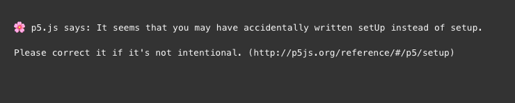

It turns out we miscapitalized `setup()` by putting an uppercase `U` . When we fix that and run the program again, we get another error message.

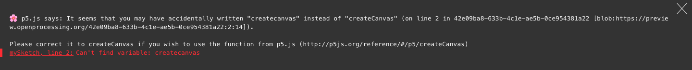

It turns out we allso miscapitalized `createCanvas()` by putting a lowercase `c` in `Canvas`. This is the last error in our program – once we fix it, the program runs without any errors.

Here is another example with several runtime errors.

```js
function setup() {
  print(x); // this won't work since x has not been defined at all
  print(y); // this won't work since y has not been defined yet
  print(50/0); // this won't work since we can't divide by zero
} 

function draw() {
  y = 50;
  ellipse(y, y); // these won't work since ellipse() needs exactly 3, 4, or 5 arguments
  ellipse(y, y, y, y, y, y);
}
```

#### Logic Errors

A **logic error** happens when there aren't any error messages but your program does something different from what you intend. These are usually the trickiest errors to fix.

Here are some general strategies to combat logic errors:

* Carefully plan out your program before writing it. We can draw flowcharts or write out algorithms in pseudocode to get an idea of what we want our program to do before start typing anything.
* Break down your program into smaller tasks and run your program once you finish each small task. This can help detect errors early and make it easier to single out where the errors are coming from.
* **Trace** the program by looking at a program line-by-line in the order that it is executed. You can use  **rubber duck debugging**, which involves explaining your code *verbally* to a rubber duck (or a pet or an any inanimate object of your choice).
* Use print statements to help detect what the issues are. We can determine which lines are working by strategically placing helpful print statements.

Here is an example of a program with logic errors in it.

```js
const SPACE_KEY = 32 // Retrieved from http://keycode.info

function setup() {
  createCanvas(800, 600);
  background(255);
}

function keyPressed() {
  if (keyCode = SPACE_KEY) // Spacebar makes a circle appear
    fill(int(random(256)), int(random(256)), int(random(256))); // the colour is random
    ellipse(int(random(801)), int(random(601)), 100, 100); // the location is random
}
```

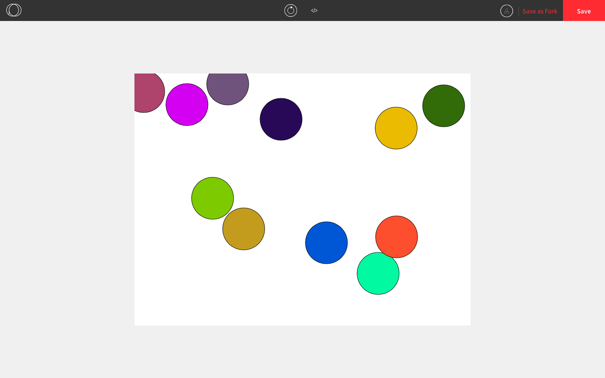

When we run the program, coloured circles appear on the screen when we press any key, but we only want them to appear when we press the spacebar. That suggests that something could be wrong in the `keyPressed()` function and sure enough, the issue is that we put `=` instead of `==` in the conditional statement. 

Confusing `=` and `==` is one of the most common bugs in programming. Even the most experienced programmers occasionally make this mistake.

```js
const SPACE_KEY = 32 

function setup() {
  createCanvas(800, 600);
  background(255);
}

function keyPressed() {
  if (keyCode == SPACE_KEY) // the operator is correct now
    fill(int(random(256)), int(random(256)), int(random(256))); 
    ellipse(int(random(801)), int(random(601)), 100, 100); 
}
```

Now when we mash the keyboard, this is what the output is like.

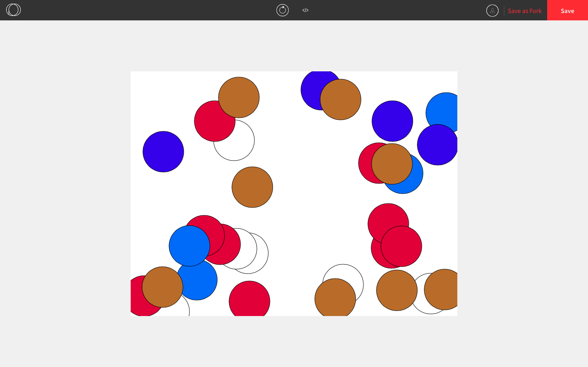

Something is still wrong since the colour is supposed to change each time and only the spacebar should make a circle apppear. This suggests that there is something wrong with the block of code that is executed when we press the spacebar. It seems as though the `ellipse()` function is called no matter what key is pressed and that is the source of the issue. Upon further inspection, there is a missing set of curly braces for the conditional statement in `keyPressed()` and so this is how the program is actually being interpreted:

```js
function keyPressed() {
  if (keyCode = SPACE_KEY) { // when the spacebar is pressed...
    fill(int(random(256)), int(random(256)), int(random(256)); // changes the circle colour when the spacebar is pressed
  }
  // when any other key is pressed...
  ellipse(int(random(801)), int(random(601)) 100, 100); // draws a circle at a random location
}
```

What we actually want is for `ellipse()` to be called only when the spacebar is pressed. We can fix this logic error by placing curly braces to indicate the correct block of code that is supposed to run when we press the spacebar.

```js
function keyPressed() {
  if (keyCode = SPACE_KEY) { // when the spacebar is pressed...
    fill(int(random(256)), int(random(256)), int(random(256)); // changes the circle colour
    ellipse(int(random(801)), int(random(601)) 100, 100); // draws a circle at a random location
  } // nothing happens if a different key is pressed
}
```


Now, suppose we are trying to make a program that creates this sketch:

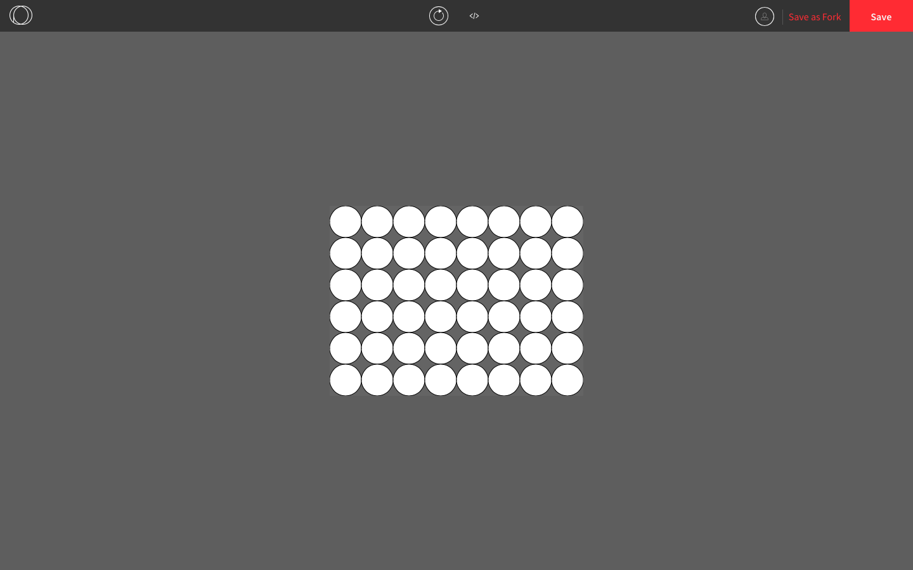

... but our program does this instead:

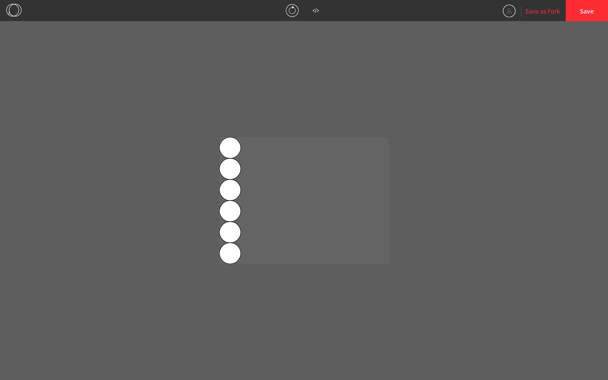

Adding print statements to our code can help determine us which lines of code are being executed and when.

```js
function setup() {
  createCanvas(400, 300);
  background(100);
  ellipseMode(CORNER);
  let x = 0;
  let y = 0;
  while (x < 400) {
    print("line 8: x = " + x); // prints the value of x when this line is run
    while (y < 300) {
      print("line 10: y = " + y); // prints the value of y when this line is run
      ellipse(x, y, 50);
      y += 50;
    }
    x += 50;
  }
}
```

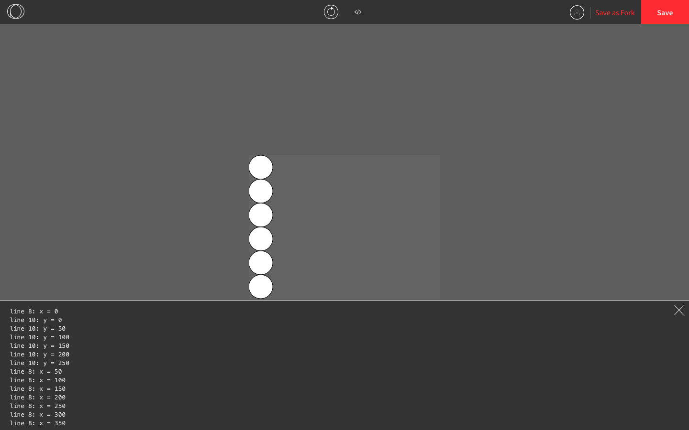

From the results in the console, we can more clearly see that the issue is that the value of `y` stays at `250` after the *while* loop from lines 9 to 13 has finished drawing one column of circles. The value of `y` needs to be reset to zero after each column so that the next column can show up.

```js
function setup() {
  createCanvas(400, 300);
  background(100);
  ellipseMode(CORNER);
  let x = 0;
  let y = 0;
  while (x < 400) {
    y = 0; // y needs to be reset to 0 after the inner while loop stops running
    while (y < 300) {
      print("The coordinate is: (" + x + ", " + y + ")"); // just checking 
      ellipse(x, y, 50);
      y += 50;
    }
    x += 50;
  }
}
```

This resolved the issue and now all the circles show up.

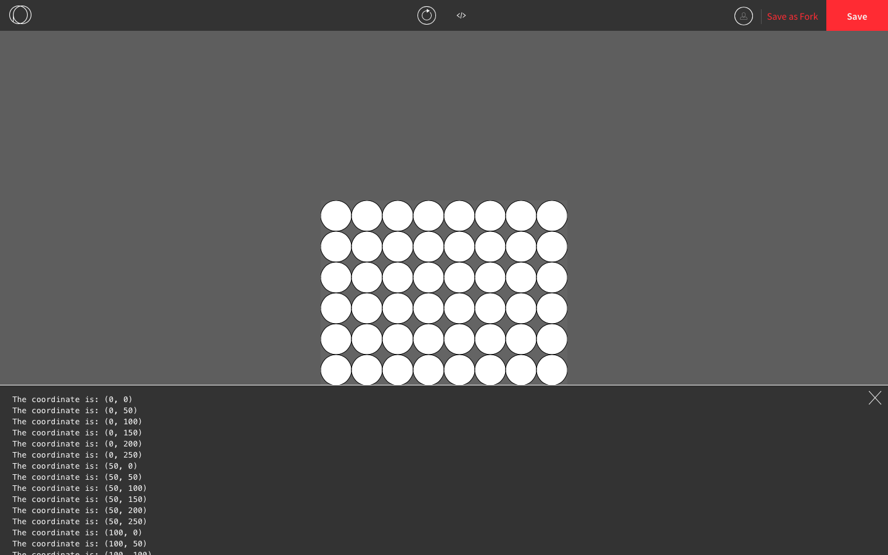
