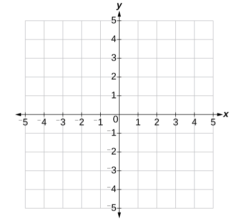

## Shapes in Processing

In the default sketch, we have the command `ellipse(mouseX, mouseY, 30, 30)`. The last two arguments represent the size of the ellipse: the width is 30 pixels and the height is also 30 pixels. The first two arguments represent the x- and y-coordinate of the center of the ellipse. Let's look at the coordinate system. 

### Screen Coordinates

Coordinates in programming are different than coordinates in math. 

In math, 2-dimensional coordinates can be graphed on a Cartesian Plane like this:

In computer science, we usually don't use the Cartesian plane for coordinates. Instead, the coordinate system we use looks like this:

For example, if we are referring to a specific pixel in an image, we would use this coordinate system instead of the Cartesian plane. 

The idea is that this is similar to how we would refer to cells in a table: The row number followed by column number, with Row 0 Column 0 representing the cell in the top-left corner. This is also similar to how we read in English: left to right, top to bottom.

The coordinate (0, 0) is referred to as the **origin**. In Processing, **the origin is the top-left corner**, not the center like in math.

### Rect(), Triangle(), Line(), and Arc()

Here are a few other functions that draw shapes.

* `rect()` 
  * Draws a rectangle
  * The top-left vertex is (x, y)
  * Takes four parameters: x, y, width, height
* `triangle()`
  * Draws a triangle 
  * The three vertices are (x1, y1), (x2, y2), and (x3, y3)
  * Takes six parameters: x1, y1, x2, y2, x3, y3
* `line()` 
  * Draws a line
  * The startig point is (x1, y1) and the stopping point is (x2, y2)
  * Takes four parameters: x1, y1, x2, y2
* `arc()`
  * Draws a portion of a circle
  * The startig point is (x1, y1) and the stopping point is (x2, y2)
  * To measure the portion of the circle, the radian system is used
    *  2 * PI = 360° (full circle)
    *  PI = 180° (semicircle)
    *  HALF_PI = 90° (quarter of a circle)
    *  QUARTER_PI = 45° (eight of a circle)
  * If you let start be 0, then you can let stop be any of the four constants above to get the exact portion you want
  * Takes six parameters: x1, y1, x2, y2, start, stop
 
