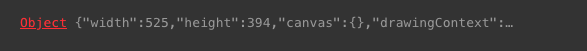
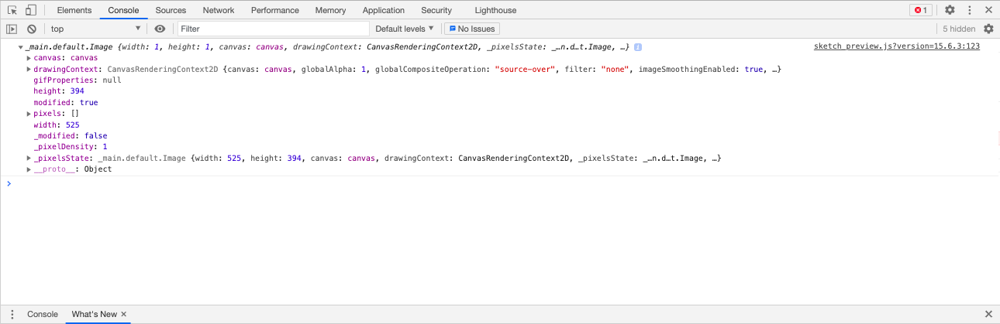
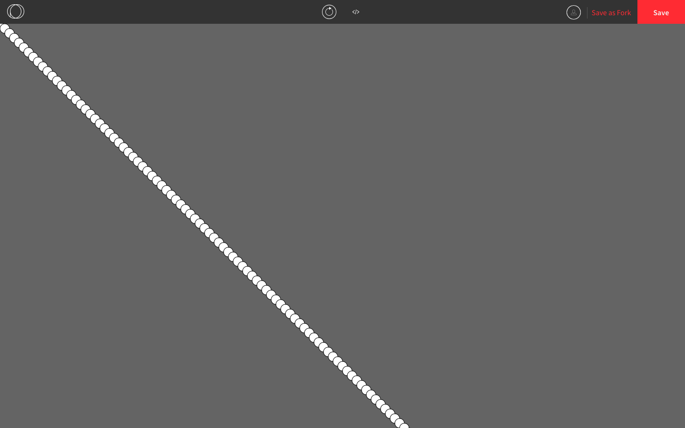
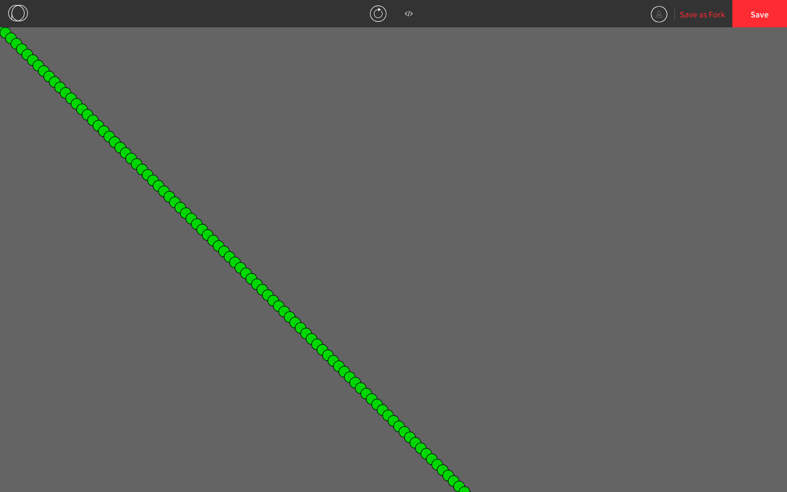

## Objects in P5.js

### Image Objects

Here is a program we saw earlier that displays an image onto the canvas.

```js
function preload() {
  doge = loadImage("doge.png");
}

function setup() {
  createCanvas(windowWidth, windowHeight);
  imageMode(CENTER);
  image(doge, windowWidth/2, windowHeight/2, doge.width, doge.height);
}
```

If we call `print(doge)` within `setup()`, here's what shows up in the console:



It tells us that `doge` is an `Object`. 

An **object** is a data type, just like numbers, strings, and booleans. Objects contain **properties**. A property is an association between a **key** and a **value**. For example, one of the properties of `doge` is `"width: 525`, where `width` is the key and `height` is the value.

### Dot Syntax

We can access the properties within an object using **dot syntax** (a.k.a. **dot notation**). We write the object name followed by a dot followed by the key we want to use. This will give us the value that is associated with that key. For example, `doge.width` gives us `525`, and `doge.height` gives us `394` (since the dimensions of the image are 525 pixels by 394 pixels).

If we want to see the full output of `print(doge)` from before, we can right-click in the browser, go to *Inspect Element*, and click on *Console*.



We can see that image objects have many properties and that several of the properties are objects that contain even more properties. That's because the image objects store all in the information needed to display the image, including the colour of each individual pixel. 

### Custom Objects

Custom objects are useful when we have many variables that are better off grouped together. For example, if we are creating a program that draws circles, we can make a circle object that has properties for its coordinates, size, colours, and any other information.

Here is a program we saw earlier.

```js
let coordinate = 0;

function setup() {
  createCanvas(windowWidth, windowHeight);
  background(100);
}
  
function draw() {
  ellipse(coordinate, coordinate, 20, 20); 
  coordinate += 10; 
}
```



The syntax for a custom object looks like this:

```js
let circle = { // "let" followed by the object name, an equal sign, and an opening brace
  coordinate: 0, // the list of properties, with the key and value separated by a colon
  diameter: 20 
} // a closing brace after all the properties are listed
```

Once we define `circle` like that, we use `circle.coordinate` and `circle.diameter` instead of `coordinate` and `diameter`.

Here's what the program looks like now. It does the same thing as before but now it's easier to read and debug if needed.

```js
let circle = { // circle is an object 
  coordinate: 0,
  diameter: 20
}

function setup() {
  createCanvas(windowWidth, windowHeight);
  background(100);
}
  
function draw() {
  ellipse(circle.coordinate, circle.coordinate, circle.diameter, circle.diameter); // dot syntax is used to get the values in the circle object
  circle.coordinate += 10; // increments work on object keys
}
```


We can add more fields if we want, such as the colours of the circle. Since each colour has three properties, we can make the colour an object with three fields. 

```js
let circle = {
  coordinate: 0,
  diameter: 20,
  colour: {
    r: 50,
    g: 205,
    b: 50
  }
}

function setup() {
  createCanvas(windowWidth, windowHeight);
  background(100);
  fill(circle.colour.r, circle.colour.g, circle.colour.b); // dot syntax looks like this when you have an object inside an object
}
  
function draw() {
  ellipse(circle.coordinate, circle.coordinate, circle.diameter, circle.diameter); 
  circle.coordinate += 10; 
}
```


