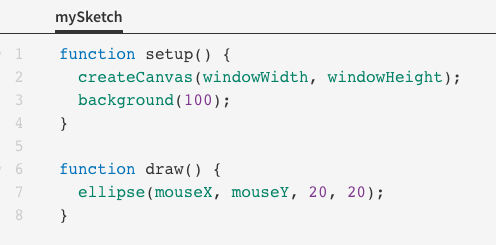

## Mouse Movement in Processing

The default sketch on openprocessing.org has the variables `mouseX` and `mouseY` that store the current x- and y-coordinates of the mouse.



This sketch repeatedly draws circles whereever the mouse goes. If we want to modify it so that only one circle shows up at a time, we can move `background(100)` to the body of `draw()`.

```js
function setup() {
	createCanvas(windowWidth, windowHeight);
}

function draw() {
	background(100);
	ellipse(mouseX, mouseY, 20, 20);
}
```


The reason this works is that the `draw()` function repeatedly redraws the background and covers up the previous circle. The reason the circle isn't flickering is that the canvas updates at the end of each cycle of `draw()`, so we see the changes to the screen all at once instead of one after the other.

If we are trying to find the coordinates of a specific pixel, we can print these mouse coordinates to the console to help us find it.

```js
function setup() {
  createCanvas(windowWidth, windowHeight);
}

function draw() {
  print(mouseX, mouseY);
}
```

The `draw()` function will repeatedly print the coordinates to the console. Every time the mouse moves, the coordinates will get updated.

There are also built-in variables for the most recent mouse coordinates: `pmouseX` and `pmouseX` (the "p" stands for previous).

We can use this to track the movement of the mouse

```js
function setup() {
  createCanvas(windowWidth, windowHeight);
}

function draw() {
  line(pmouseX, pmouseY, mouseX, mouseY);
}
```

This program will continuously draw a line every time the mouse moves, leaving a trail of the places the cursor has been to.


