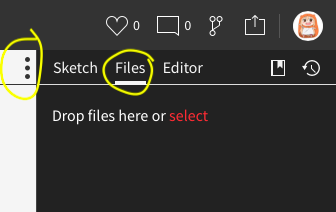
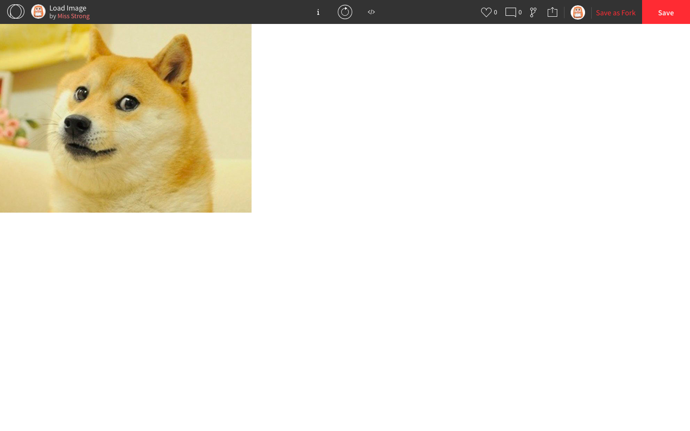
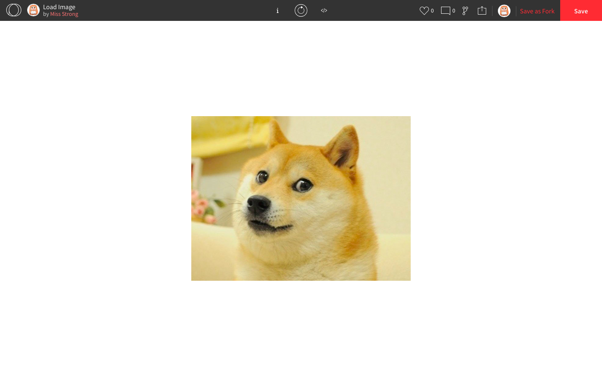
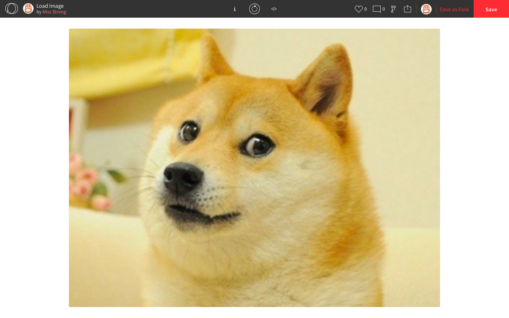
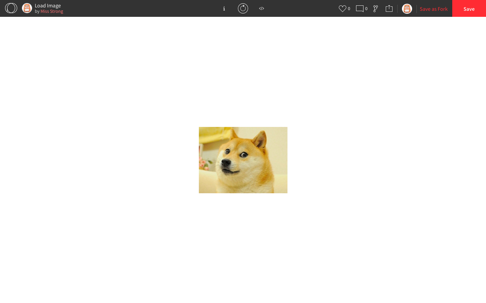

## Images in Processing

To upload an image to use in your program, click on the kebab menu (the vertical ellipses `⋮`) then *Files*. There, you can drag and drop the image.



The first step is to override the `preload()` function. This is a built-in function that automatically runs before `setup()` does. It only runs once and it is used to preloading any external files smoothly. Inside the body of `preload()`, we use `loadImage()` to load the image. We need this loaded image, so we need to **store it in a variable**. We can do this by giving the variable a name and using the **assignment operator** `=` to assign it to its initial value.

Next, we use the `image()` function  to display the image onto our canvas. The `image()` function takes five parameters: the loaded image, the x-coordinate of the top-left corner, the y-coordinate of the top-left corner, the width of the image, and the height of the image. If you leave the last two parameters out, it uses the width and height of the original image.

```js
function preload() {
  doge = loadImage("doge.png") // doge.png is the name of the image file
}

function setup() {
	createCanvas(windowWidth, windowHeight);
	image(doge, 0, 0); // the top-left corner of the image will be (0, 0)
}
```

Here is the result:



If we want to display the image in the center of the canvas instead of the 

```js
function preload() {
  doge = loadImage("doge.png") // doge.png is the name of the image file
}

function setup() {
	createCanvas(windowWidth, windowHeight);
  imageMode(CENTER); // the image() function below will take the center coordinates
	image(doge, windowWidth/2, windowHeight/2); // the center of the image will be (windowWidth/2, windowHeight/2)
}
```

Here is the result:



If we want to change the size of the image by scaling it up or down, we can make use of `doge.width` and `doge.height`. If your image is named something else, replace `doge` with the name you used with the `loadImage()` function.

```js
function preload() {
  doge = loadImage("doge.png")
}

function setup() {
	createCanvas(windowWidth, windowHeight);
	imageMode(CENTER);
	image(doge, windowWidth/2, windowHeight/2, 2*doge.width, 2*doge.height); // doubles the dimensions of the image
}
```

Since we are increasing the size of the image, it will not retain its original quality.

Here is the result:



```js
function preload() {
  doge = loadImage("doge.png")
}

function setup() {
	createCanvas(windowWidth, windowHeight);
	imageMode(CENTER);
	image(doge, windowWidth/2, windowHeight/2, doge.width/2, doge.height/2); // halves the dimensions of the image
}
```

Here is the result:


